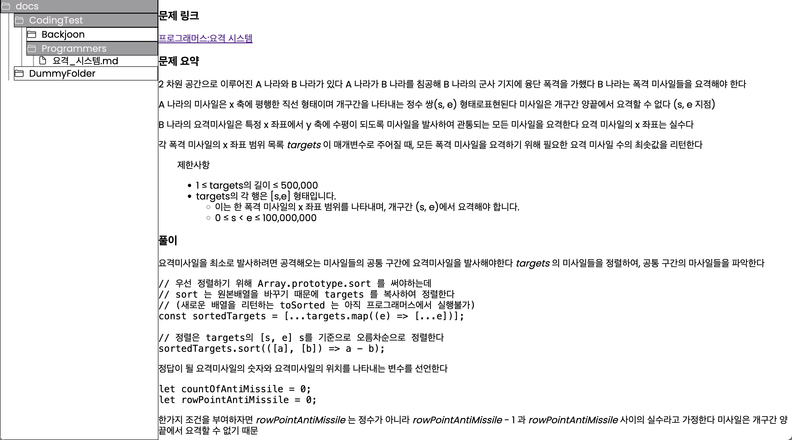
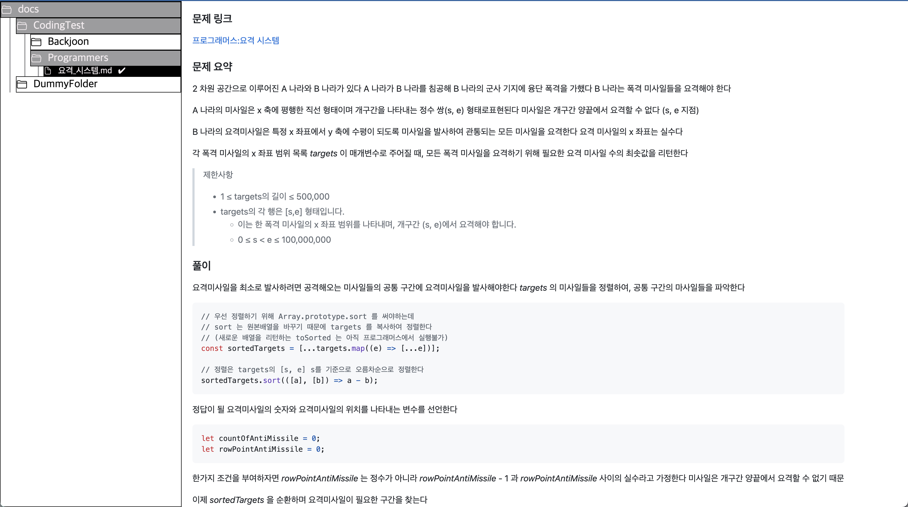

## 폴더형 개발 블로그

폴더 형식의 개발 블로그입니다.

흔히 사용하는 컴퓨터의 파일 시스템처럼 글을 폴더로 분류하고 저장합니다.

필요한 자료를 쉽게 발견 및 접근할 수 있도록 구현하는 것이 목적입니다.

## 업데이트 사항

### [1.0.1 업데이트 사항](https://github.com/Je0ngGil/Je0ngGil.github.io/issues/13)

- ### 뷰 테마

  기존에 docs폴더의 markdown 파일들을 웹에 렌더링하기 위해 아무런 CSS없이  
  markdown -> html 변환하는 라이브러리만 사용했습니다.  
  처음에는 단순히 HTML만 렌더링하고 읽을 수만 있으면 충분하다고 생각했지만,  
  HTML 하나만으로는 글을 읽기에 단락 구분이 힘들어 문서의 가독성이 매우 떨어진다고 느꼈습니다.  
  또한 업데이트 사항에 버그라고 생각했던 markdown 파일 안에 code블록들이 작동되지 않는다는  
  사실 정상적으로 \<code> 태그로 변환되어 작동하고 있었고,  
  CSS로 해당 태그를 꾸미지 않았기 때문에 아무런 구분없이 렌더링되고 있었다는 점을 알게됐습니다.
  따라서 이번 업데이트에서
  !!!!!!!!!!

  적용한 테마는 github-markdown-css 이다.  
  추후에 여러 테마를 추가해서 테마를 골라 문서를 볼 수 있도록 하면 좋을 것 같다.

- ### \ 태그 이미지 적용이 안됨

  markdown에선 이미지를 첨부하는 방법은 두 가지다

  1. **\![이미지 설명]\(이미지 경로)**
  2. **\**

  기존 사용한 라이브러리는 첫 번째 방식을 파싱하지 못하고 이미지 태그를 단순 문자열로 변환했다.  
  markdown -> html 변환 라이브러리를 변경해야 했는데,  
  추후에 여러 뷰 테마를 추가 적용하기 위해서 markdown -> html 변환하는 방법은 각 테마마다 달라야 했다.  
  이유는 테마마다 markdown -> html 변환시 tag에 사용하는 css선택자 이름이 제각각이기 때문이다.  
  이번에 추가한 테마는 github markdown 스타일을 복제한 테마이다.  
  [github-markdown-css](https://github.com/sindresorhus/github-markdown-css)

- ### 현재 선택된 문서를 표시

  폴더를 열어 문서를 클릭했을 때 어느 문서에 들어와 있는지 표시하는 기능을 추가했다.

- ### 전
  
- ### 후
  
